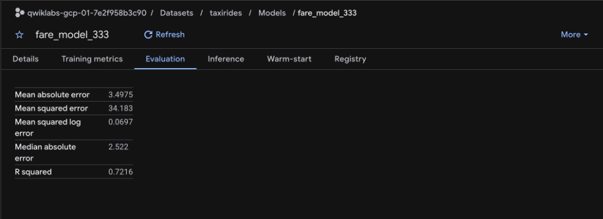
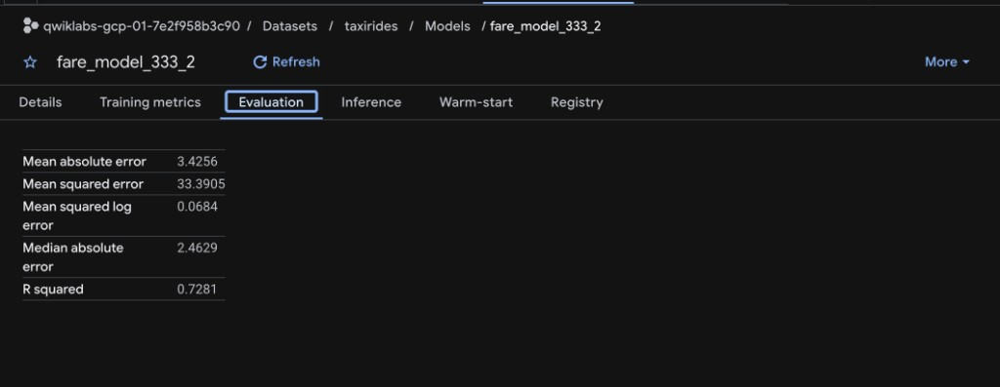

# Engineer Data for Predictive Modeling with BigQuery ML: Challenge Lab

Evaluation metrics from the BigQuery ML model UI (lab target: RMSE ≤ 10).

RMSE is derived as `SQRT(mean_squared_error)`.

## `taxirides.fare_model_333`

Features: euclidean distance via `TRANSFORM` (day/hour commented out).

| Metric | Value |
| --- | --- |
| Mean absolute error | 3.4975 |
| Mean squared error | 34.183 |
| Mean squared log error | 0.0697 |
| Median absolute error | 2.522 |
| R squared | 0.7216 |
| RMSE (`√MSE`) | ≈ 5.85 |

## `taxirides.fare_model_333_2`

Features: euclidean distance + `dayofweek` + `hourofday`.

| Metric | Value |
| --- | --- |
| Mean absolute error | 3.4256 |
| Mean squared error | 33.3905 |
| Mean squared log error | 0.0684 |
| Median absolute error | 2.4629 |
| R squared | 0.7281 |
| RMSE (`√MSE`) | ≈ 5.78 |

Both models meet RMSE ≤ 10. Batch predictions for the lab used `fare_model_333` → `taxirides.2015_fare_amount_predictions`.

SQL write-up: [`Engineer Data for Predictive Modeling with BigQuery ML: Challenge Lab.sql`](Engineer%20Data%20for%20Predictive%20Modeling%20with%20BigQuery%20ML%3A%20Challenge%20Lab.sql)
